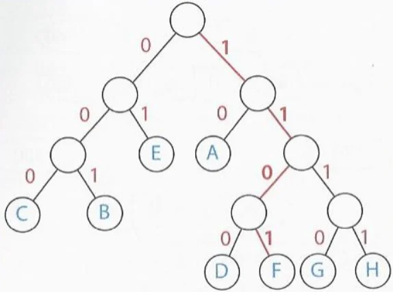

# 42-WoodyWoodpacker

> vpoirot, bgaertne

> Projet decouverte des "packers".

## Fonctionnement d'un Packer

Un `Packer`est un outils utilisé pour compresser et chiffrer des exécutables. 
Un programme passé dans un packer est réduit en taille, et rendu illisible. 
Lorsque le programme est exécuté, il est d'abord chargé en mémoire sous sa forme compressée et chiffrée. 
Juste avant l'exécution, il est décompressé et déchiffré en mémoire pour etre executé normalement. 

## Utilité d'un Packer

- La compression reduit la taille de l'executable. Utile pour la distribution de logiciel. 
- Le chiffrement aide a protege la propriete intellectuelle en complexifiant le reverse engineering de l'executable, ou sa modification. 
- le chiffrement permet aussi de passer inapercu pendant les scans antivirus. Le code malveillant n'etant visible que peu avant l'execution, dans la memoire. 

## Algorithme de compression
> vpoirot's part

Il nous faut un algo de type lossless (sans perte de donnee) et avec un ratio equilibre entre la vitesse et le taux de compression. 
En temps normal les meilleurs algo vont avoir des pertes et vont priorise le taux de compression, mais dans un packer la decompression doit se faire 
au moment de l'execution du programme donc elle doit aller vite. 
L'algo choisi est celui d'Huffman qui a pour principe de former un arbre binaire pour relier chaque elements a un code. 
Les elements avec avec une haute repetitions auront un code petit et inversement pour les elements a petites repetitions.  

## Algorithme de chiffrement utilise
> bgaertne's part

> You are free to choose the encryption algorithm.
> The complexity of your algorithm will nonetheless be a very important part of the grading. You have to justify your choice during the evaluation. An easy ROT isn’t considered an advanced algorithm 

Il nous faut un algo plus costaud qu'un ROT. On va aussi s'abstenir de prendre un XOR, trop simple. 
On cherche un truc pas compliquer a implementer, mais un peu relou a defaire sans la bonne cle; Le TEA, Tiny Encryption Algorithm. 
Une dizaine de ligne pour chiffrer, une autre dizaine pour dechiffrer, et on utilise un clef generer aleatoirement. 
Le [TEA](https://fr.wikipedia.org/wiki/Tiny_Encryption_Algorithm) est un algo de chiffrement par bloc, en reseau de Feistel 32 tours. 

notes:
bgaertne@k0r3p14:Desktop/Woody_WoodPacker ‹main*›$ make fclean               
Deleting woody_woodpacker objs ✔️
Deleting woody_woodpacker binary ✔️
bgaertne@k0r3p14:Desktop/Woody_WoodPacker ‹main*›$ make                      
Compilation of woody_woodpacker ...
woody_woodpacker created ✔️
Compilation of woody_unpacker ...
woody_unpacker created ✔️
Compilation of stub ...
stub created ✔️
bgaertne@k0r3p14:Desktop/Woody_WoodPacker ‹main*›$ ./woody_woodpacker test   
Generated key: 6BAA498AC6C99DFD4EFA5369FE451BC1
bgaertne@k0r3p14:Desktop/Woody_WoodPacker ‹main*›$ cat stub encrypted > final
bgaertne@k0r3p14:Desktop/Woody_WoodPacker ‹main*›$ chmod +x final            
bgaertne@k0r3p14:Desktop/Woody_WoodPacker ‹main*›$ ./final                   
Failed to deserialize Huffman tree
bgaertne@k0r3p14:Desktop/Woody_WoodPacker ‹main*›$ make fclean
Deleting woody_woodpacker objs ✔️
Deleting woody_woodpacker binary ✔️
bgaertne@k0r3p14:Desktop/Woody_WoodPacker ‹main*›$ 